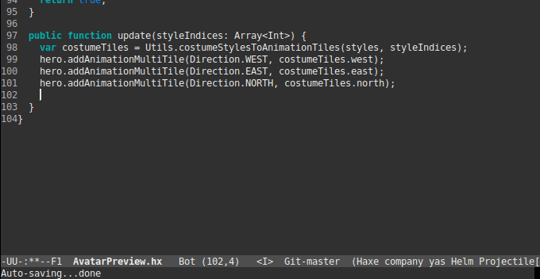

# Haxemacs

Work in progress Emacs major mode for Haxe. Currently working with Haxe 3.47. It will be reworked when Haxe 4 is released with the compiler services revamp.

## Usage

### Emacs Setup

Add the `src` path to be loaded in your `init.el`

    (add-to-list 'load-path "/path/to/haxemacs/src")
    
Then `require` the following packages:

    (require 'haxe-mode) ;; Syntax highlighting
    (require 'company-haxe) ;; Autocomplete (depends on company)
    (require 'haxe-eldoc) ;; Eldoc
    
Or if using `use-package`:
    
    (use-package haxe-mode)
    (use-package company-haxe)
    (use-package haxe-eldoc)
    
### Project Steup

Create a `.haxe-root` file in the source directory, pointing to the `build.hxml` file.

e.g. in `/Source/.haxe-root`:

    ../abs-build.hxml
    
Then in `/abs-build.hxml`

    -main MainJs
    -js Source/app.js
    -D openfl=8.6.4
    -cp /home/xdl/dev/openfl-yarpge/node_modules/openfl/lib
    -cp /home/xdl/dev/openfl-yarpge/node_modules/actuate/lib
    -cp Source
    -D source-map
    
Note that any external libraries used in the build included with the `cp` flag need to contain their absolute paths.

## Tests

Add the `test` path to be loaded in your `init.el`

    (add-to-list 'load-path "/path/to/haxemacs/test")
    (require 'run-tests) ;; or (use-package 'run-tests)
    
Run with:
    
    (ert t)

# Useful Resources

* Emacs Haxe completion: https://github.com/cloudshift/hx-emacs/blob/master/hxc-complete.el
* Emacs Haxe syntax: https://bitbucket.org/jpsecher/haxe-mode/src/default/
* Emacs Resources: http://old.haxe.org/com/ide/emacs
* Emacs Mode tutorial: https://www.emacswiki.org/emacs/ModeTutorial
* Intro into parsing: https://www.gnu.org/software/emacs/manual/html_node/elisp/Parser-State.html#Parser-State
* Go eldoc: https://github.com/syohex/emacs-go-eldoc
* Tide (TypeScript implementation): https://github.com/ananthakumaran/tide/blob/master/tide.el
* Adding a new language to Emacs http://www.wilfred.me.uk/blog/2015/03/19/adding-a-new-language-to-emacs/
